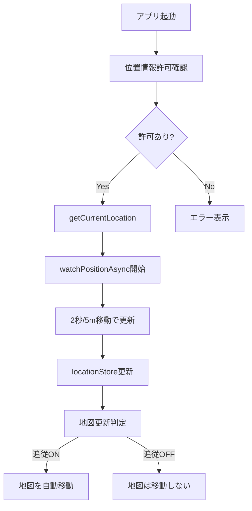

# 位置情報取得と地図更新のアーキテクチャ

## 現在の実装概要

### 1. 位置情報の取得頻度と設定

**位置情報の更新設定（location-store.ts）**
```typescript
settings: {
  locationUpdateInterval: 2000,    // 2秒ごとに位置を更新
  highAccuracyMode: true,         // 高精度モード使用
  distanceFilter: 5,              // 5メートル移動で更新
  headingUpdateInterval: 100,     // 100ミリ秒ごとに方向を更新
}
```

### 2. 位置情報の取得フロー



### 3. 主要コンポーネントの役割

#### 3.1 useLocation Hook
- **初期化**: アプリ起動時に位置情報の許可を確認し、監視を開始
- **監視**: `Location.watchPositionAsync`で継続的に位置を監視
- **更新条件**: 2秒経過 または 5m移動

#### 3.2 location-store
- **状態管理**: 現在位置、エラー、設定を保持
- **永続化**: 設定（更新間隔、精度モード等）をMMKVで保存

#### 3.3 useMapWithLocation Hook
- **地図連携**: locationStoreの変更を監視し、追従モードON時に地図を更新
- **追従制御**: ユーザーの操作に応じて追従ON/OFFを切り替え

### 4. 位置情報更新の詳細

**Location.watchPositionAsync の設定**
```typescript
{
  accuracy: Location.Accuracy.High,  // 高精度（GPS使用）
  timeInterval: 2000,                // 最小2秒間隔
  distanceInterval: 5,               // 最小5m移動
}
```

**実際の更新タイミング**
- 2秒経過 AND 5m以上移動した場合に更新
- どちらかの条件を満たしても、もう一方の条件も満たす必要がある

### 5. 方向（heading）情報の独立更新

**別途、高頻度で方向を更新**
```typescript
Location.watchHeadingAsync({
  accuracy: 6,  // 6度の精度
}, (heading) => {
  // 100ms間隔で方向のみ更新
})
```

## Supabase保存の実装案

### 1. 移動距離の計算

```typescript
// 距離計算関数（Haversine formula）
function calculateDistance(lat1: number, lon1: number, lat2: number, lon2: number): number {
  const R = 6371e3; // 地球の半径（メートル）
  const φ1 = lat1 * Math.PI/180;
  const φ2 = lat2 * Math.PI/180;
  const Δφ = (lat2-lat1) * Math.PI/180;
  const Δλ = (lon2-lon1) * Math.PI/180;

  const a = Math.sin(Δφ/2) * Math.sin(Δφ/2) +
            Math.cos(φ1) * Math.cos(φ2) *
            Math.sin(Δλ/2) * Math.sin(Δλ/2);
  const c = 2 * Math.atan2(Math.sqrt(a), Math.sqrt(1-a));

  return R * c; // メートル単位の距離
}
```

### 2. Supabase保存の実装イメージ

```typescript
// location-store.ts に追加
interface LocationState {
  // ... 既存の状態
  lastSavedLocation: UserLocationData | null;  // 最後に保存した位置
}

// アクション追加
setCurrentLocation: (location) => set((state) => {
  state.currentLocation = location;
  
  // 5m以上移動したらSupabaseに保存
  if (state.lastSavedLocation) {
    const distance = calculateDistance(
      state.lastSavedLocation.coords.latitude,
      state.lastSavedLocation.coords.longitude,
      location.coords.latitude,
      location.coords.longitude
    );
    
    if (distance >= 5) {
      // Supabaseに保存（非同期で実行）
      saveLocationToSupabase(location);
      state.lastSavedLocation = location;
    }
  } else {
    // 初回は必ず保存
    saveLocationToSupabase(location);
    state.lastSavedLocation = location;
  }
});
```

### 3. Supabaseテーブル設計案(ここは DataModel.md も参考に考える必要がある)

```sql
-- user_locations テーブル
CREATE TABLE user_locations (
  id UUID DEFAULT gen_random_uuid() PRIMARY KEY,
  user_id UUID REFERENCES auth.users(id) NOT NULL,
  latitude DOUBLE PRECISION NOT NULL,
  longitude DOUBLE PRECISION NOT NULL,
  accuracy DOUBLE PRECISION,
  heading DOUBLE PRECISION,
  speed DOUBLE PRECISION,
  altitude DOUBLE PRECISION,
  recorded_at TIMESTAMP WITH TIME ZONE DEFAULT NOW(),
  created_at TIMESTAMP WITH TIME ZONE DEFAULT NOW()
);

-- インデックス
CREATE INDEX idx_user_locations_user_id ON user_locations(user_id);
CREATE INDEX idx_user_locations_recorded_at ON user_locations(recorded_at);
```

### 4. 実装時の考慮事項

1. **バッテリー消費**
   - 高頻度の位置情報取得はバッテリーを消費
   - バックグラウンドでの動作制限

2. **ネットワーク通信**
   - オフライン時の処理（キューイング）
   - 通信エラーのリトライ処理

3. **プライバシー**
   - 位置情報の保存についてユーザーへの明示的な同意
   - データの暗号化

4. **最適化**
   - バッチ処理（複数の位置情報をまとめて送信）
   - 不要なデータの定期削除

## 現在の設定値の妥当性

- **2秒間隔**: 歩行速度（時速4km）で約2.2m移動。適切な更新頻度
- **5m移動**: 小さな動きは無視し、意味のある移動のみ検出
- **100ms方向更新**: スムーズな方向表示のために必要

これらの設定は、バッテリー消費と精度のバランスが取れた値となっています。